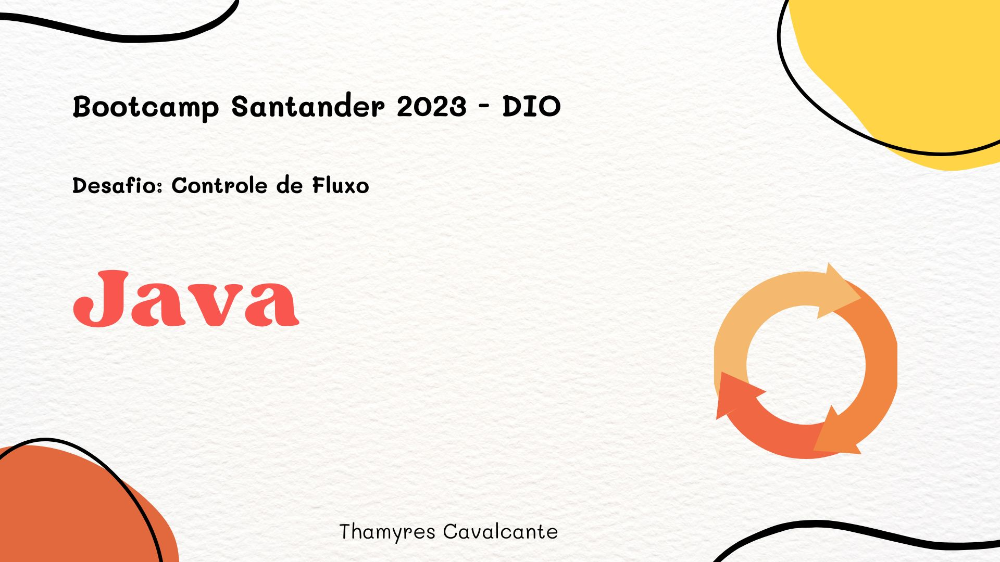
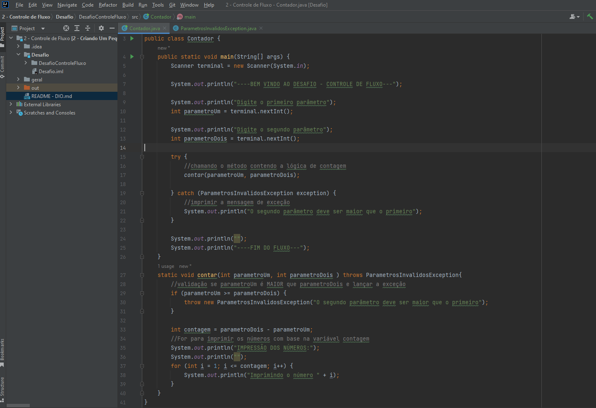

| Desafio | BOOTCAMP SANTANDER 2023 - DIO  |
| -------------  |--------------------------------|
| Nome        | **Desafio Controle de fluxo**  
| Tecnologias | Java, Intellij                 
| URL         | https://github.com/Thamyresmya/Desafio2_Santander_Dio-Controle-de-fluxo

# Desafio Controle de fluxo

 

  <a href="#-tecnologias">Tecnologias</a>&nbsp;&nbsp;&nbsp;|&nbsp;&nbsp;&nbsp;  
  <a href="#-projeto">Projeto</a>&nbsp;&nbsp;&nbsp;|&nbsp;&nbsp;&nbsp;  
  <a href="#-gif">Gif</a>&nbsp;&nbsp;&nbsp;&nbsp;&nbsp;&nbsp;

 

## 🚀 Tecnologias

Esse projeto foi desenvolvido com as seguintes tecnologias:

- Java
- Intellij
- Git e Github

## 💻 Projeto

Projeto desenvolvido durante o bootcamp Santander 2023 da DIO, ultilizando java e a IDE Intellij. O desafio consiste em criar um projeto, para exercitar todo o conteúdo apresentado no módulo de Controle de Fluxo codificando o seguinte cenário.

Desafio - Controle de Fluxo

O sistema deverá receber dois parâmetros via terminal que representarão dois números inteiros, com estes dois números você deverá obter a quantidade de interações (for) e realizar a impressão no console (System.out.print) dos números incrementados, exemplo:

* Se você passar os números 12 e 30, logo teremos uma interação (for) com 18 ocorrências para imprimir os números, exemplo: `Imprimindo o número 1`, `Imprimindo o número 2` e assim por diante.
* Se o primeiro parâmetro for MAIOR que o segundo parâmetro, você deverá lançar a exceção customizada chamada de ParametrosInvalidosException com a segunda mensagem: `O segundo parâmetro deve ser maior que o primeiro`

1 - Crie o projeto `DesafioControleFluxo`

2 - Dentro do projeto, crie a classe `Contador.java` para realizar toda a codificação do nosso programa.

3 - Dentro do projeto, crie a classe `ParametrosInvalidosException` que representará a exceção de negócio no sistema.

## 📁 Acesso ao projeto

É possível acessar o código através do [Link](https://github.com/Thamyresmya/Desafio2_Santander_Dio-Controle-de-fluxo)

Neste repositório você tem acesso a todo o material desenvolvido.

## ✔️ Técnicas e tecnologias utilizadas

- `JAVA`:  A linguagem de programação Java é objetivada principalmente na orientação a objeto, independência de plataforma, recursos de rede, carga dinâmica de código e segurança, além disso, é uma linguagem copilada.

 

## 📸 Gif

Código  
</img>

Projeto funcionando 
</img>

 

Me siga nas redes sociais:
- [Linkedin](https://www.linkedin.com/in/thamyrescavalcante/)
- [Instagran](https://www.instagram.com/thamyres__cavalcante/)

 

---

Feito com ♥ by Thamyres Cavalcante.